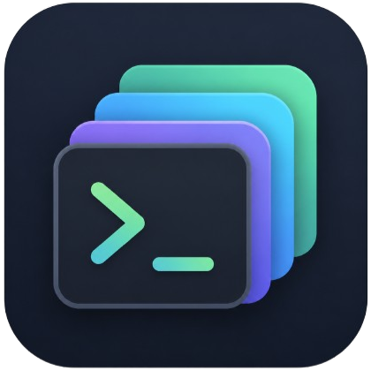

<p align="center">
  
</p>

# HostDeck

`host_deck` 是 HostDeck 的当前 Dart 包名。HostDeck 是一个跨平台远程主机工作台，当前由四部分组成：

- Flutter 桌面壳：负责窗口承载、日志面板和内置后端服务
- Dart CLI 服务：入口为 `bin/server.dart`，可独立以 B/S 模式运行
- Vue 3 前端：当前主前端位于 `host-deck-ui/`
- Electron Windows 壳：复用 `host-deck-ui/` 前端和 Dart CLI 服务进行桌面打包

当前开发、Docker 构建和发布流程都以 `host-deck-ui/` 为准。

## 功能概览

- SSH 登录与服务器保存
- 桌面式工作台、多窗口、Dock、窗口切换器
- 多会话终端
- OpenCode 应用入口，可自动启动远端 `opencode web` 并打开 Web 窗口
- 通用内嵌 Web 应用窗口
- 文件管理、收藏目录、桌面钉住目录
- 端口链接桌面钉住
- 文本编辑与图片/视频预览
- 系统监控
- 运行态会话查看
- Docker 容器、镜像、网络、卷与 Compose 管理
- 主题、壁纸与终端字体设置

## 开发文档

近期已补充模块化开发文档，建议从 `docs/README.md` 开始阅读：

- `docs/architecture.md`：整体架构、运行形态和请求流转
- `docs/backend.md`：Dart 服务端分层、路由和依赖组装
- `docs/frontend.md`：Vue 前端目录、状态管理和 HTTP 约定
- `docs/api-contract.md`：统一响应、错误处理和 WebSocket 约定
- `docs/development.md`：本地开发流程
- `docs/build-and-release.md`：构建与发布流程
- `docs/testing.md`：测试与校验流程
- `docs/modules/*.md`：认证、终端、文件、Docker、桌面工作台等模块说明

## 技术栈

### 后端 / 桌面壳

- Flutter
- Dart
- shelf / shelf_router / shelf_web_socket
- dartssh2
- sqlite3
- logging

### 前端

- Vue 3
- TypeScript
- Vite
- Naive UI
- UnoCSS
- Pinia
- Vue Router
- TanStack Vue Query
- Axios
- xterm.js
- Monaco Editor
- xgplayer
- Electron / electron-builder

## 前置要求

- Flutter SDK
- Node.js 20+
- pnpm

先安装依赖：

```bash
flutter pub get
pnpm --dir host-deck-ui install
```

## 开发模式

### 1. Flutter 桌面壳调试模式

当前 Flutter 桌面调试模式会在 WebView 中加载 Vite 开发服务器，所以需要前端和 Flutter 同时启动。

终端 A：

```bash
pnpm --dir host-deck-ui dev
```

终端 B：

```bash
flutter run -d windows
```

说明：

- Vite 开发服务器端口以 `host-deck-ui/vite.config.ts` 的 `server.port` 为准。
- Electron 开发模式会从 Vite 配置读取开发服务器地址，也可通过 `HOST_DECK_ELECTRON_DEV_URL` 覆盖。
- `lib/main.dart` 的 Flutter debug WebView 仍硬编码加载 `http://localhost:5173`，调试桌面壳前需要先统一端口，或临时让 Vite 使用 5173
- Flutter 内置后端默认监听 `http://localhost:8080`
- `host-deck-ui/vite.config.ts` 会把 `/api` 代理到 `http://localhost:8080`，其中终端 WebSocket 使用 `/api/ws/terminal`

如需在 macOS/Linux 调试桌面壳，把 `windows` 替换为对应设备即可。

### 2. 纯 Dart B/S 模式

先构建前端，再启动 CLI 服务：

```bash
pnpm --dir host-deck-ui build
dart run bin/server.dart --host 0.0.0.0 --port 8080 --web-dir host-deck-ui/dist
```

启动后访问 `http://localhost:8080`。

常用参数：

- `--host <value>`：绑定地址，默认 `0.0.0.0`
- `--port <value>`：监听端口，默认 `8080`
- `--web-dir <path>`：静态前端资源目录
- `--data-dir <path>`：sqlite 与配置文件目录

如果未显式传入 `--web-dir`，`bin/server.dart` 会尝试从可执行文件旁的 `../web` 自动发现静态资源目录。

## 桌面发布构建

Flutter release 构建会打包 `assets/web/` 里的静态资源，因此在本地构建桌面安装包前，需要先准备前端产物。

基本流程：

```bash
pnpm --dir host-deck-ui build
# 将 host-deck-ui/dist 的内容同步到 assets/web/
flutter build windows --release
```

GitHub Actions 的 `.github/workflows/release.yml` 已经会先构建 `host-deck-ui/dist`，再把产物放入 `assets/web/` 后执行 Windows 桌面构建。

当前发布工作流启用的产物包括：

- Docker 镜像 tar.gz
- Flutter Windows zip
- Electron Windows exe/zip

Linux、macOS、Android 和纯 Dart bundle 的发布 job 目前保留在工作流中但处于注释状态。

### Electron Windows 构建

Electron Windows 壳位于 `host-deck-ui/electron/`，构建时会先生成 Dart CLI 服务 bundle，再把前端 `dist/` 和服务可执行文件打入安装包。

```bash
pnpm --dir host-deck-ui install
pnpm --dir host-deck-ui electron:build:win
```

构建结果位于 `host-deck-ui/release/`。

## 纯 Dart 服务打包

Windows 可直接使用脚本构建 CLI bundle：

```powershell
.\scripts\build_server.ps1
```

脚本会安装并构建 `host-deck-ui/`，执行 `flutter pub get` 和 `dart build cli`，再把前端产物复制到 `build/server/bundle/web/`，并生成 `build/server/start_server.bat`。

也可以手动构建：

```bash
pnpm --dir host-deck-ui build
flutter pub get
dart build cli --target bin/server.dart -o build/server
# 将 host-deck-ui/dist 的内容同步到 build/server/bundle/web/
```

构建结果位于 `build/server/bundle/`：

- `build/server/bundle/bin/server(.exe)`：服务可执行文件
- `build/server/bundle/lib/`：运行时动态库
- `build/server/bundle/web/`：前端静态资源

说明：`scripts/build_server.ps1` 和 `scripts/build_server.sh` 都使用当前前端目录 `host-deck-ui/`。

## Docker

`Dockerfile` 当前会直接构建 `host-deck-ui/` 与 Dart CLI 服务：

```bash
docker build -t host-deck:local .
docker run --rm -p 8080:8080 -v host-deck-data:/data host-deck:local
```

容器默认启动参数：

- `--host 0.0.0.0`
- `--port 8080`
- `--web-dir /app/web`
- `--data-dir /data`

## 常用校验命令

仓库根目录：

```bash
flutter analyze
flutter test
```

前端目录 `host-deck-ui/`：

```bash
pnpm build
pnpm exec vue-tsc -p tsconfig.app.json --noEmit
pnpm test
```

单个前端测试示例：

```bash
pnpm exec vitest run src/views/Files/components/__tests__/FilePickerDialog.spec.ts
```

## 项目结构

```text
host_deck/
├── bin/                 # Dart CLI 服务入口
├── docs/                # 架构、开发、构建、测试与模块文档
├── lib/                 # Flutter 桌面壳与内置后端服务
├── host-deck-ui/        # 当前主前端工程
├── assets/web/          # Flutter release 打包使用的静态资源
├── scripts/             # 服务打包脚本
├── test/                # Flutter/Dart 测试
└── README.md
```

## 开源协议

本项目采用 [MIT License](LICENSE) 开源。
