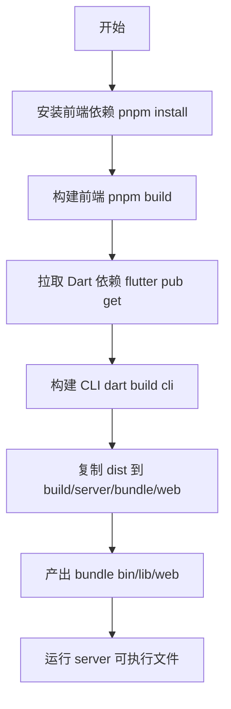
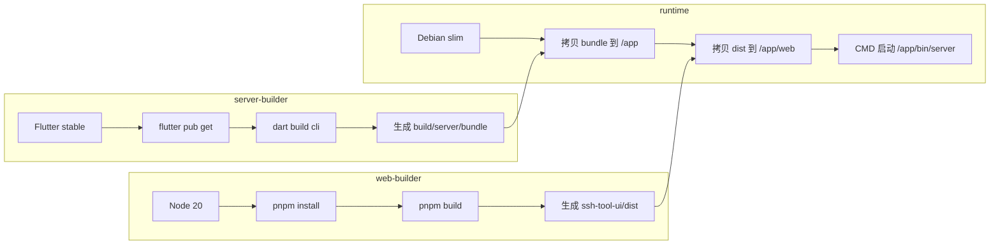
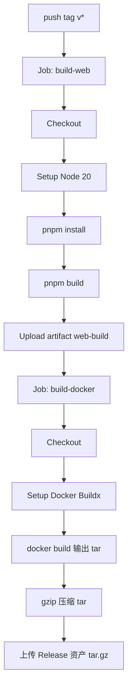

# 当前项目构建流程分析

本文档基于仓库当前实现（Flutter/Dart + Vue 3 + Docker + GitHub Actions）整理，覆盖本地开发构建、发布构建与产物流转。

## 1. 构建对象与关系

- 前端：`ssh-tool-ui/`（Vite + Vue 3 + TypeScript），构建产物为 `dist/`。
- 后端：Dart/Flutter 服务端，入口为 `bin/server.dart`，可构建为 CLI 可执行程序。
- 桌面壳：Flutter Desktop（Windows/macOS/Linux），会打包 `assets/web/` 静态资源。
- 容器：`Dockerfile` 采用多阶段构建，将前端 `dist` 与 Dart CLI bundle 组合进最终镜像。

核心关系：前端静态资源是后端/桌面壳运行 Web UI 的依赖，构建流程通常先产出前端，再注入后端产物。

## 2. 本地开发与构建流程

### 2.1 前端（`ssh-tool-ui/`）

常用命令（`ssh-tool-ui/package.json`）：

- `pnpm dev`：启动 Vite 开发服务器。
- `pnpm build`：生成 `ssh-tool-ui/dist`。
- `pnpm build:assets`：直接输出到 `../assets/web`（用于 Flutter 壳内置静态资源）。
- `pnpm preview`：预览构建产物。

代理配置（`ssh-tool-ui/vite.config.ts`）：

- `/api` 与 `/socket.io` 代理到 `http://localhost:8080`。
- 本地联调时，后端应监听 `8080` 才能直接透传。

### 2.2 后端（仓库根目录）

- 依赖安装：`flutter pub get`
- 直接运行（开发）：`dart run bin/server.dart --host 0.0.0.0 --port 8080 --web-dir ssh-tool-ui/dist`
- CLI 构建：`dart build cli --target bin/server.dart -o build/server`

`bin/server.dart` 支持参数：

- `--host`（默认 `0.0.0.0`）
- `--port`（默认 `8080`）
- `--web-dir`（静态资源目录）
- `--data-dir`（sqlite/配置目录）

若未显式传 `--web-dir`，会尝试自动发现可执行文件旁的 `../web` 目录。

### 2.3 一键打包脚本

脚本位置：`scripts/build_server.sh`、`scripts/build_server.ps1`

两者流程一致：

1. 安装并构建前端（`pnpm install` + `pnpm build`）。
2. 拉取 Dart/Flutter 依赖（`flutter pub get`）。
3. 构建 Dart CLI bundle（输出到 `build/server`）。
4. 将 `ssh-tool-ui/dist` 复制到 `build/server/bundle/web`。

Windows 脚本额外生成 `build/server/start_server.bat`，用于本地快速启动可执行程序。

## 3. Docker 构建流程

`Dockerfile` 为三阶段：

1. `web-builder`：在 Node 20 环境执行 `pnpm build` 生成前端 `dist`。
2. `server-builder`：在 Flutter 环境执行 `flutter pub get` + `dart build cli` 生成服务端 bundle。
3. `runtime`：Debian slim，仅安装运行时依赖并拷贝两类产物：
   - `/app/bin/server` 等 CLI bundle
   - `/app/web`（来自前端 `dist`）

容器启动命令：

`/app/bin/server --host 0.0.0.0 --port 8080 --web-dir /app/web --data-dir /data`

这保证镜像开箱即用：后端和前端静态资源都在同一个进程/容器内提供。

## 4. CI/CD 发布流程（GitHub Actions）

工作流文件：`.github/workflows/release.yml`

触发条件：推送 tag（`v*`）

### 4.1 当前启用的 Job

1. `build-web`
   - Checkout
   - Node 20 + pnpm install
   - `pnpm build`
   - 上传 `ssh-tool-ui/dist` 为 artifact（`web-build`）

2. `build-docker`（依赖 `build-web`）
   - 使用 `docker/build-push-action`
   - 构建 Docker image 并导出 tar：`/tmp/ssh-tool-<tag>.tar`
   - gzip 压缩后上传到 GitHub Release 资产

### 4.2 当前注释（未启用）的 Job

- Dart CLI 跨平台打包（Windows/Linux/macOS）
- Flutter 桌面打包（Windows/Linux/macOS）
- Android APK 打包

说明：仓库中仍保留这些流程模板，但默认发布只产出 Docker 镜像 tar.gz。

## 5. 产物清单与流转

### 本地脚本产物

- `build/server/bundle/bin/server(.exe)`：服务端可执行程序
- `build/server/bundle/lib/`：运行时动态库
- `build/server/bundle/web/`：前端静态资源

### CI 发布产物（当前）

- `ssh-tool-<tag>.tar.gz`：Docker 镜像离线包（Release Asset）

## 6. 关键特点与注意事项

### 特点

- 前后端构建已标准化为“前端先行，后端注入静态资源”。
- 本地脚本、Dockerfile、CI 工作流三者目标一致，产物结构相似。
- CLI 入口参数设计清晰，方便在本地/容器/部署环境切换。

### 注意事项

- CI 的 `build-web` 产物未直接传递给 `build-docker`（`build-docker` 内会重新构建），存在重复构建成本。
- 桌面构建依赖 `assets/web/`，而主流程常产出 `ssh-tool-ui/dist`；切换到桌面发布时需确认资源复制步骤。
- 当前默认发布通道偏向 Docker，若需要多平台二进制分发，可按注释模板恢复对应 Job。

## 7. 建议优化方向（可选）

1. 减少 CI 重复构建：让 `build-docker` 复用 `build-web` artifact（或合并策略）。
2. 增加前端类型检查步骤：在 CI 中加入 `pnpm exec vue-tsc -p tsconfig.app.json --noEmit`。
3. 增加 Dart/Flutter 质量门禁：`flutter analyze` + 关键测试。
4. 按发布目标拆分工作流：Docker 发布与桌面安装包发布分离，降低维护复杂度。

## 8. 构建流程图（Mermaid）

### 8.1 本地打包流程（scripts/build_server）

### 8.2 Docker 多阶段构建流程

### 8.3 GitHub Release 工作流（当前启用）

